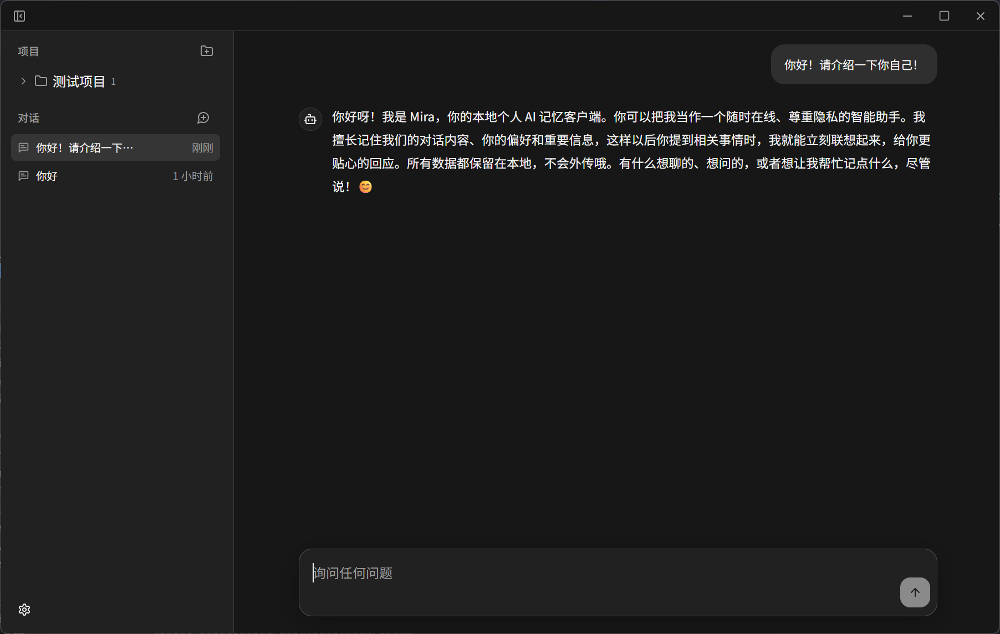

<div align="center">

# Mira

**一个足够简单的、支持记忆的开源大模型聊天客户端**

仿照 ChatGPT 设计 · 本地优先 · 轻量 · 易于改造

[功能](#功能) · [为什么做](#为什么做-mira) · [快速开始](#快速开始) · [技术栈](#技术栈) · [贡献](#欢迎-fork)

简体中文 · **[English](README.md)**

</div>

---

## 为什么做 Mira

我需要一个**足够简单**的开源大模型聊天软件，并且支持记忆功能。

市面上的方案要么太重，要么把模型和记忆绑死在某个云服务上，要么代码复杂到改不动。于是我仿照 ChatGPT 的设计写了 Mira——**轻量、支持自定义模型、易于自己修改**。

如果你也想要一个属于自己的、能记住你说过什么的大模型聊天应用，欢迎 fork 出去，改成最适合你自己的样子。

## 功能

- **聊天** — ChatGPT 风格的对话界面，支持 Markdown 渲染和代码高亮
- **长期记忆** — 自动从对话中提炼记忆，跨对话注入相关上下文；也支持手动保存记忆
- **多 Provider 配置** — 任意 OpenAI-compatible 接口（OpenAI、DeepSeek、Ollama、自建网关……），API Key 存入系统凭据库
- **项目组织** — 用项目归类对话，项目内对话共享上下文
- **本地存储** — 所有数据存在本地 SQLite，不上传任何服务器
- **中英双语** — 界面支持中英文切换，默认英文

## 截图



## 快速开始

### 下载安装

前往 [Releases 页面](https://github.com/MrSibe/Mira/releases) 下载对应平台的安装包：

| 平台                       | 文件                                                           |
| -------------------------- | -------------------------------------------------------------- |
| **Windows**                | `Mira_<版本>_x64-setup.msi.zip` 或 `Mira_<版本>_x64_en-US.msi` |
| **macOS（Intel）**         | `Mira_<版本>_x64.dmg`                                          |
| **macOS（Apple Silicon）** | `Mira_<版本>_aarch64.dmg`                                      |
| **Linux**                  | `Mira_<版本>_amd64.deb` 或 `Mira_<版本>_amd64.AppImage`        |

下载后直接安装即可使用，**无需任何开发环境**。

> 首次打开 Mira 时会提示配置 API Provider。  
> 你需要一个 **OpenAI-compatible 的 API Key** 才能开始聊天——可以是 OpenAI、DeepSeek 或其他兼容服务商。

### 自行构建

如果你希望从源码构建（需要 [Node.js](https://nodejs.org/) 22+、[pnpm](https://pnpm.io/) 11+、[Rust](https://www.rust-lang.org/) stable）：

```bash
pnpm install
pnpm tauri build
```

构建产物在 `src-tauri/target/release/bundle/`。

## 技术栈

| 层       | 技术                                          |
| -------- | --------------------------------------------- |
| 前端     | React 19 · TypeScript · TailwindCSS · Zustand |
| 桌面框架 | Tauri 2                                       |
| 后端     | Rust · OpenAI-compatible HTTP 模型网关        |
| 存储     | SQLite（本地文件）                            |
| 凭据     | 系统凭据库（keyring）                         |
| 国际化   | 轻量自建 i18n（中/英）                        |

## 架构

```txt
React UI
  ↓ invoke
Tauri Commands
  ↓
Chat Service
  ↓
Model Gateway
  ↓
Memory Observer / Injection / Cleaner
  ↓
SQLite
```

## 目录结构

```txt
src
├── components      # UI 组件
├── pages           # 聊天页 / 设置页
├── store           # Zustand 状态管理
├── core            # Tauri 客户端 & 类型
├── i18n            # 国际化（en / zh）
└── utils           # 工具函数

src-tauri/src
├── chat.rs         # Tauri 命令入口
├── database.rs     # SQLite 数据层
├── memory.rs       # 记忆提炼 & 注入
├── model.rs        # OpenAI-compatible 模型网关
├── secrets.rs      # 系统凭据库读写
└── types.rs        # 共享类型
```

## 文档

- [架构说明](docs/architecture.md)
- [记忆系统](docs/memory-system.md)
- [项目上下文](docs/project-context.md)
- [安全说明](docs/security.md)

## 范围边界

v1 只做本机单用户、纯聊天、长期记忆、SQLite 本地存储、多 Provider 配置。

**不做：** RAG、向量数据库、工具调用、多用户、云同步。

## 欢迎 fork

Mira 的代码刻意保持简单和可读。如果你想要一个属于自己的大模型聊天应用，fork 它，然后：

- 换成你喜欢的 UI 风格
- 接入你自己的模型或网关
- 调整记忆策略
- 加上你想要的功能

PR 欢迎，但请先开 issue 讨论改动方向。

## License

[GPL-3.0](LICENSE)
